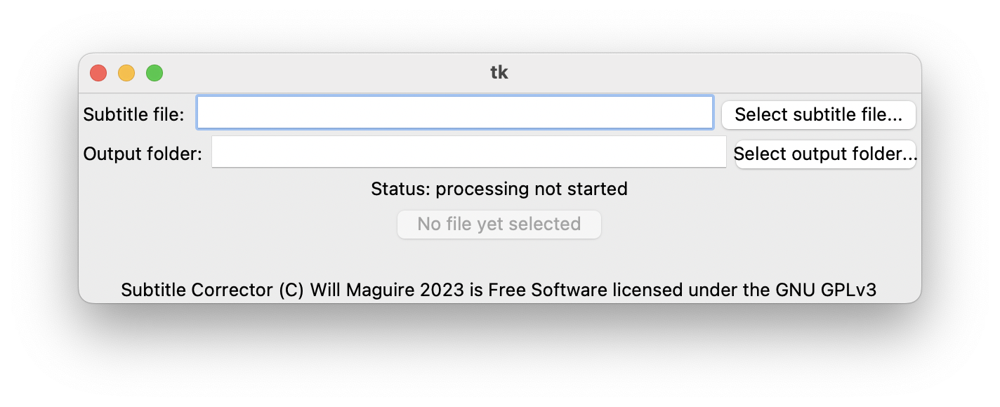

# Subtitle Corrector
This program aims to streamline the process of error checking automatically generated subtitles by leveraging ChatGPT.
## Documentation:
### Installing openai API key:
Prior to using the program the user has to specify their openai API key so that the program can successfully query chatGPT.
#### Windows:
Press START (The Windows button) and type in environment, you will see the option "edit the system environment variables".
Click it and a GUI will appear, at the bottom there is a button which says "Environment variables..."
Click this button and it will take you to a new menu, below the user variables list click "New" and create new variable
with the name "OPENAI_API_KEY" and with its value being the key itself. Click OK, and now you're done.
#### macOS/GNU + Linux
Open your terminal and run the following commands:
```
echo 'export OPENAI_API_KEY="[insert your key here between the brackets]"' >> ~/.zshrc (.bashrc if on GNU + Linux)
```
### Using the program:
#### GUI

Double click the Executable as with any other program.
Select the input .srt, and the directory to output the processed .srt; then click "process subtitle file".
#### TUI
You can invoke the program in TUI mode as so:
```
Windows: python3 .\SRT-tui.py example.srt --ofile example_output.srt
macOS/GNU + Linux: ./SRT-tui.py example.srt --ofile example_output.srt
```
The program will then query ChatGPT and write it's response to a new file called output.srt, which will be located in the output directory.

### License:
This program is licensed under the GNU General Public License Version 3, and thus is Free Software. 
